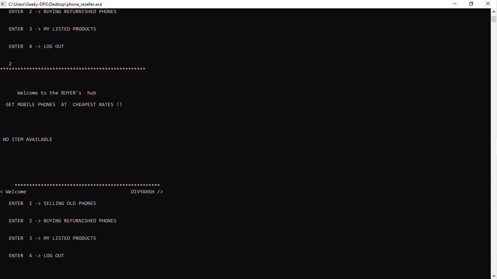
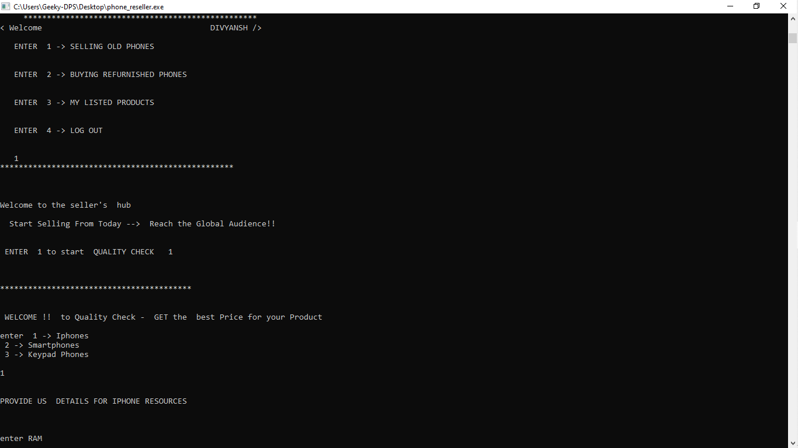

# Resell-Old-Mobile-phones
This is my first sem project . This is basically a platform developed using C language to resell and buy old refurnished mobile phones .  

##Welcome Screen -> Prompts user to login using Name and Mobile number

 
## After login user  is provided with  3 options 
### 1 -> to add  new Product to sell 
### 2 -> second option opens seller's  window where  user  can buy  listed  products
### 3 -> third option shows  the products thst user has listed to sell
### 4 -> fourth option is to log out of the Account
 

## When user selects 1st option to add Product , He  is directed to Quality check window where , user can enter  their device specifications and get estimated fare and sell their item.

## When 1st user added his product and then new user registered and can see the product by choosing the 2nd option

 
 

### You can download the windows executable file from [HERE](./output/phone_reseller.exe)
 

#### In future  i am looking forward to update and upgrade this project !!
